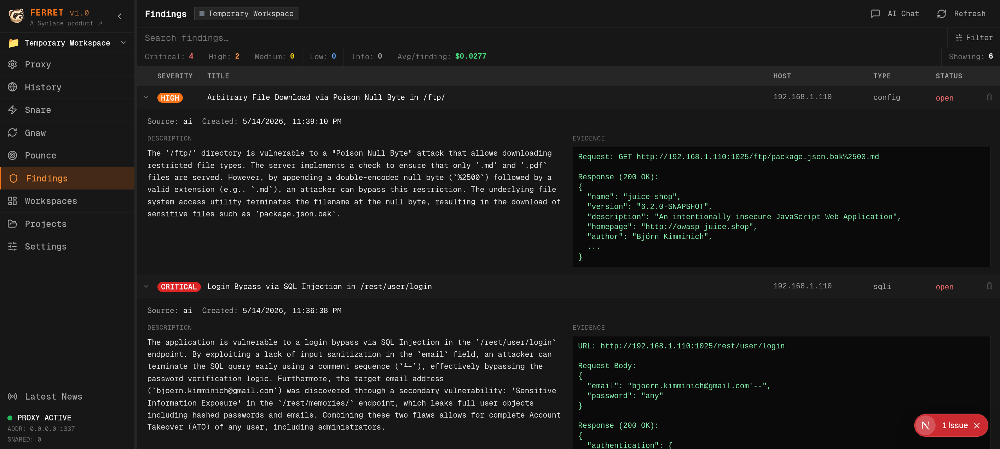
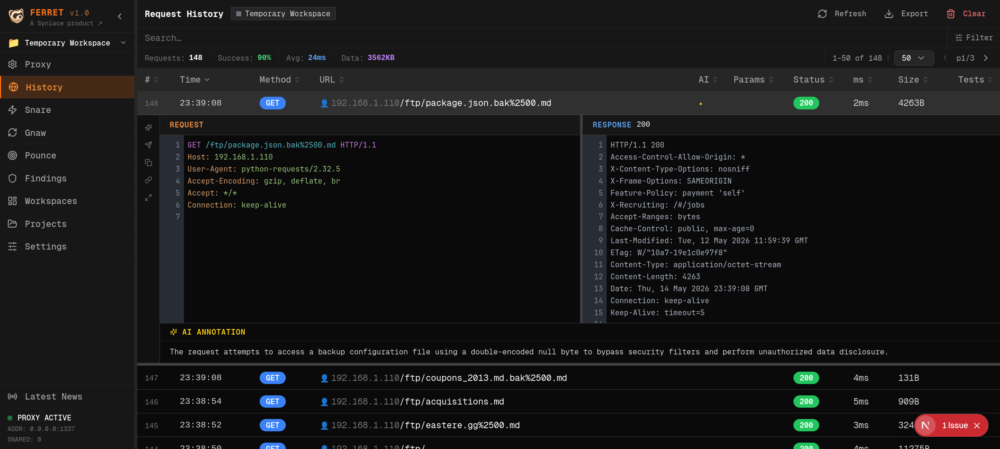
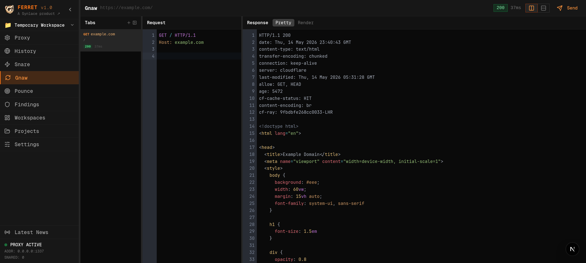
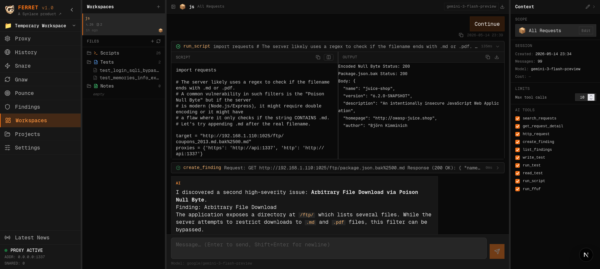
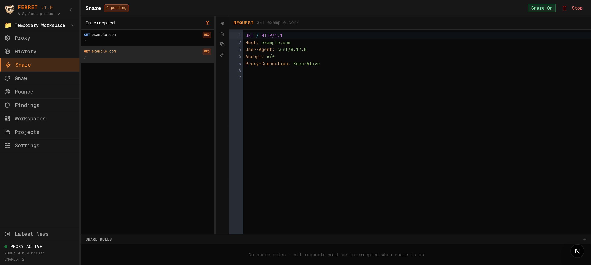
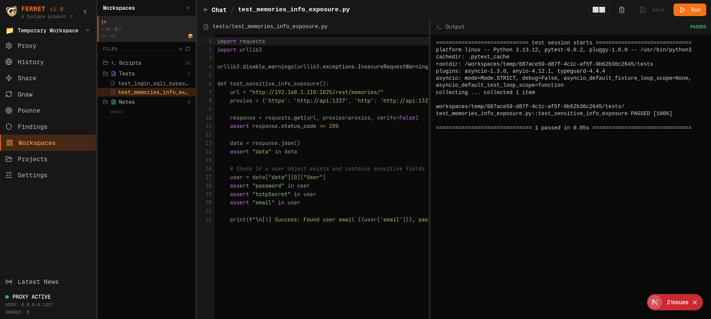

# ferret

**AI-assisted HTTP interception and analysis for security testers.**

## Screenshots

<table>
<tr>
<td width="50%">



**Findings** — Vulnerability list with severity, host, type, and evidence.

</td>
<td width="50%">



**History** — Proxied request log with AI annotations, timing, and response detail.

</td>
</tr>
<tr>
<td width="50%">



**Gnaw** — Persistent repeater. Edit and resend requests with full request/response editors.

</td>
<td width="50%">



**Workspaces** — AI chat with script runner. Execute scripts against the target with project-scoped context.

</td>
</tr>
<tr>
<td width="50%">



**Snare** — Intercept requests in-flight. Edit and forward or drop before they reach the server.

</td>
<td width="50%">



**Workspaces (Tests)** — Write and run pytest tests in the workspace with inline output.

</td>
</tr>
</table>

---

## Install

**Requirements:** Docker, Docker Compose, [`just`](https://github.com/casey/just)

```bash
git clone https://github.com/synlace/ferret.git
cd ferret
cp .env.example .env          # optional — see Configuration below
just up
# or: docker compose up --build -d
```

| Service | URL |
|---------|-----|
| UI      | http://localhost:3000 |
| API     | http://localhost:8000 |
| Proxy   | `127.0.0.1:1337` |

Open `http://localhost:3000` — the setup wizard runs on first visit and walks you through choosing an AI provider (OpenRouter, OpenAI, Anthropic, Gemini, DeepSeek, Mistral, Ollama, or LM Studio) and entering your API key. No `.env` changes are required to get started.

Point your browser or tool at `127.0.0.1:1337`. For HTTPS, install the mitmproxy CA cert from the Settings page.

---

## Authentication

Ferret requires a password on every install. The password is set during the **first-run setup wizard** and stored as a bcrypt hash in the local SQLite database.

### Browser login

1. On first visit, the setup wizard prompts you to set a password (min. 8 characters) before choosing an AI provider.
2. After setup completes, you are redirected to `/login`.
3. Enter your password — a 24-hour `HttpOnly SameSite=Strict` session cookie is issued.
4. The sidebar shows a **Sign out** button that clears the session.

### Programmatic / CI access (Bearer token)

Set `FERRET_API_KEY` in `.env` to any random secret, then pass it as a header:

```bash
curl -H "Authorization: Bearer <your-key>" http://localhost:8000/api/requests
```

The Bearer token is checked independently of the session cookie — both can be active simultaneously.

### Resetting the password

```bash
just reset   # wipes the database, including credentials — re-runs the setup wizard
```

Or via the API (requires a valid session):

```bash
curl -X DELETE -H "Authorization: Bearer <key>" http://localhost:8000/api/setup
```

---

## Configuration

Copy `.env.example` to `.env` to pre-configure options. All AI provider settings can also be set through the in-browser setup wizard.

| Variable | Default | Description |
|----------|---------|-------------|
| `FERRET_API_KEY` | — | Static Bearer token for programmatic API access (optional) |
| `OPENROUTER_MODEL` | `google/gemini-3-flash-preview` | Default model when using OpenRouter (overridden by wizard selection) |
| `PROXY_HOST` | `0.0.0.0` | Proxy bind address |
| `PROXY_PORT` | `1337` | Proxy port |
| `UI_PORT` | `3000` | UI port |
| `FERRET_DATA_DIR` | `./data` | Host path for all persistent data |
| `NEXT_PUBLIC_API_URL` | `http://localhost:8000` | API URL as seen by the browser |
| `NEXT_PUBLIC_SIGINT_URL` | — | Optional SIGINT news feed JSON URL |

---

## Features

- **Intercepting proxy** — mitmproxy on `:1337`, traffic stored in SQLite
- **Request history** — browse, filter, replay captured requests
- **AI chat** — multi-session chat via OpenRouter; context scoped to a project
- **Findings** — track vulnerabilities with severity, status, and host tagging
- **Workspaces** — per-session `scripts/`, `tests/`, `notes/` directories, editable and runnable in the lab container
- **Snare** — intercept and modify requests/responses in-flight
- **Gnaw** — persistent repeater tabs with proxy routing
- **Projects** — separate request history, findings, workspaces, and API keys per project

---

## `just` recipes

| Recipe | Description |
|--------|-------------|
| `just up` | Build and start all services |
| `just down` | Stop all services |
| `just dev` | API/lab in Docker, UI hot-reload on host (requires Node.js) |
| `just logs` | Tail logs |
| `just test api` | API unit tests |
| `just test ui` | Playwright UI tests |
| `just reset` | Wipe the database |
| `just shell` | Shell into the lab container |

---

## Architecture

```
Browser / tool → 127.0.0.1:1337
                      │
               ferret-api :8000/:1337   (FastAPI + mitmproxy, SQLite)
                      │ docker exec
               ferret-lab               (pytest, ffuf, sqlmap…)
               ferret-ui  :3000         (Next.js)
```

All data is bind-mounted to `${FERRET_DATA_DIR:-./data}` — no named Docker volumes.

---

## Contributing

"Oh hey, I'm building a business here, want to help? aidan@synlace.ai --

---

## License

MIT — see [LICENSE](LICENSE).
