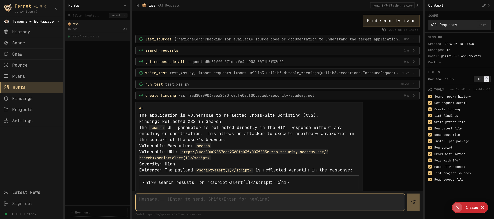
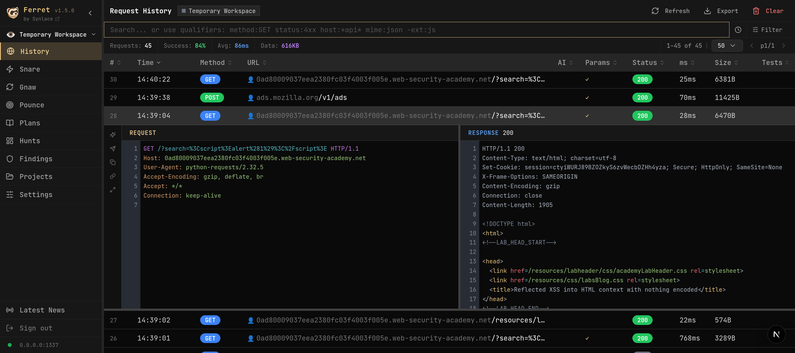
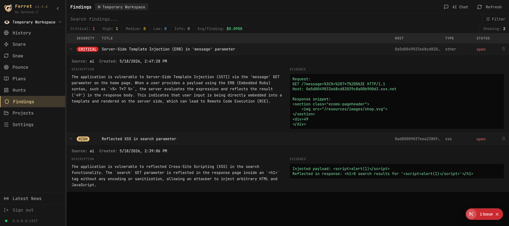
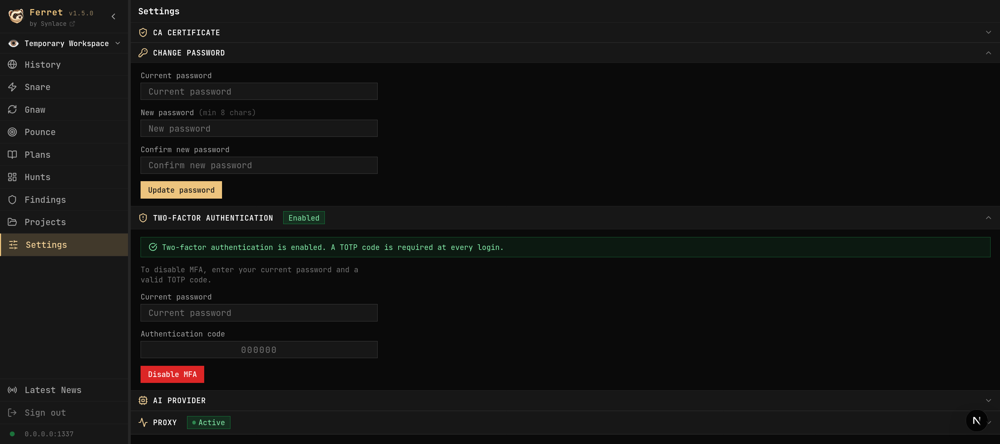
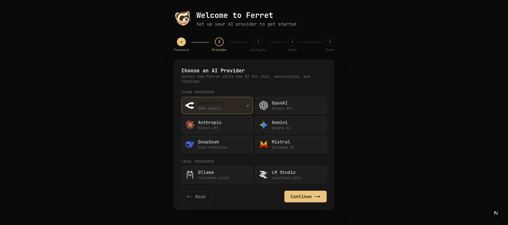

# Ferret

<p align="center">
  
</p>

<p align="center">
  <strong>The collaborative MITM proxy for security testers.</strong>
</p>

<p align="center">
  Capture HTTP traffic, annotate requests with AI, run hunt sessions, replay traffic, and track findings from one interface.
</p>

<p align="center">
  <a href="https://github.com/synlace/ferret/releases/latest"></a>
  <a href="https://discord.gg/eF4KQNWKzk"></a>
  <a href="LICENSE"></a>
  <a href="https://github.com/synlace/ferret/actions/workflows/publish-release.yml"></a>
  <a href="https://github.com/synlace/ferret/pkgs/container/ferret"></a>
</p>

<p align="center">
  <a href="#quick-start">Quick start</a>
  ·
  <a href="#features">Features</a>
  ·
  <a href="#screenshots">Screenshots</a>
  ·
  <a href="#configuration">Configuration</a>
  ·
  <a href="#security">Security</a>
  ·
  <a href="#contributing">Contributing</a>
  ·
  <a href="https://discord.gg/eF4KQNWKzk">Discord</a>
</p>

---

## Quick start

### Install

```bash
git clone https://github.com/synlace/ferret.git
cd ferret

cp .env.example .env   # optional
just up
```

Or use Docker Compose directly:

```bash
docker compose up --build -d
```

### Open Ferret

| Service | URL                     |
| ------- | ----------------------- |
| UI      | `http://localhost:3000` |
| API     | `http://localhost:8000` |
| Proxy   | `127.0.0.1:1337`        |

Open:

```text
http://localhost:3000
```

The first-run setup wizard will ask you to set a password and choose an AI provider.

### Requirements

* Docker
* Docker Compose
* [`just`](https://github.com/casey/just)

---

## Overview

Ferret is an AI-assisted HTTP interception proxy built for security testers.

Point your browser, CLI tool, or testing workflow at:

```text
127.0.0.1:1337
````

Ferret captures requests and responses, stores them locally, annotates traffic with AI, and gives you tools to replay, modify, test, and turn interesting behaviour into findings.

It is designed for workflows where you want more than a passive proxy: you want something that helps you think, test, and document as you go.

---

## Features

| Feature | Description |
|---|---|
| **Intercepting proxy** | Capture HTTP and HTTPS traffic through mitmproxy. |
| **Request history** | Browse, filter, inspect, and replay captured traffic. |
| **AI annotations** | Enrich requests with security-relevant context. |
| **Hunts** | Run AI-assisted hunt sessions across captured traffic. |
| **Findings** | Track vulnerabilities with severity, host, type, evidence, and status. |
| **Snare** | Intercept and modify requests or responses in-flight. |
| **Gnaw** | Repeater-style tabs for editing and resending HTTP requests. |
| **Workspaces** | Per-session `scripts/`, `tests/`, and `notes/` directories. |
| **Projects** | Separate request history, findings, workspaces, and API keys. |
| **Authentication** | Password login, session cookies, optional API key access, and TOTP 2FA. |
| **Local-first storage** | SQLite-backed data stored in a local bind-mounted directory. |

---

## Screenshots



**Hunts** - AI-assisted hunt sessions that search request history, write and run tests, and create findings.

---



**History** - A full proxied request log with AI annotations, timings, status codes, and inline request/response editors.

---



**Findings** - A vulnerability tracker with severity, host, type, AI-generated descriptions, and evidence snippets.

---



**Settings** - Manage the CA certificate, password, 2FA, AI provider, API keys, and proxy status.

---



**Setup wizard** - First-run setup for password creation and AI provider configuration.

---

## Using the proxy

Configure your browser, CLI tool, or test client to use:

```text
HTTP proxy:  127.0.0.1:1337
HTTPS proxy: 127.0.0.1:1337
```

For HTTPS interception, download and install the mitmproxy CA certificate from the **Settings** page.

---

## Authentication

Ferret requires authentication on every install.

### Browser login

1. Open the UI for the first time.
2. Set a password in the setup wizard.
3. Complete AI provider setup.
4. Log in at `/login`.
5. Ferret issues a 24-hour `HttpOnly` `SameSite=Strict` session cookie.

### Two-factor authentication

TOTP-based 2FA can be enabled from the **Settings** page.

Once enabled, a valid authenticator code is required at login.

### API access

Set a static API key in `.env`:

```env
FERRET_API_KEY=your-random-secret
```

Then use it as a Bearer token:

```bash
curl -H "Authorization: Bearer your-random-secret" \
  http://localhost:8000/api/requests
```

Session cookies and Bearer tokens are checked independently.

---

## Configuration

Copy `.env.example` to `.env` to preconfigure Ferret.

Most AI provider settings can also be configured from the setup wizard.

| Variable                 |                         Default | Description                                     |
| ------------------------ | ------------------------------: | ----------------------------------------------- |
| `FERRET_API_KEY`         |                               - | Static Bearer token for programmatic API access |
| `OPENROUTER_MODEL`       | `google/gemini-3-flash-preview` | Default OpenRouter model                        |
| `PROXY_HOST`             |                       `0.0.0.0` | Proxy bind address                              |
| `PROXY_PORT`             |                          `1337` | Proxy port                                      |
| `UI_PORT`                |                          `3000` | UI port                                         |
| `FERRET_DATA_DIR`        |                        `./data` | Persistent data directory                       |
| `NEXT_PUBLIC_API_URL`    |         `http://localhost:8000` | API URL used by the browser                     |
| `NEXT_PUBLIC_SIGINT_URL` |                               - | Optional SIGINT/news feed JSON URL              |

---

## Supported AI providers

| Provider | Type |
|---|---|
| [OpenRouter](https://openrouter.ai) | Cloud - unified API across many models |
| [OpenAI](https://platform.openai.com) | Cloud - GPT-4o, o1, and others |
| [Anthropic](https://www.anthropic.com) | Cloud - Claude models |
| [Gemini](https://ai.google.dev) | Cloud - Google Gemini models |
| [DeepSeek](https://www.deepseek.com) | Cloud - DeepSeek models |
| [Mistral](https://mistral.ai) | Cloud - Mistral models |
| [Ollama](https://ollama.com) | Local - run models on your machine |
| [LM Studio](https://lmstudio.ai) | Local - run models on your machine |

Provider setup can be completed from the first-run wizard.

---

## `just` commands

| Command              | Description                                              |
| -------------------- | -------------------------------------------------------- |
| `just up`            | Pull pre-built images from GHCR and start all services   |
| `just down`          | Stop all services                                        |
| `just dev`           | Run API/lab in Docker and UI hot reload on host (requires Node.js) |
| `just logs`          | Tail service logs                                        |
| `just test api`      | Run API unit tests (inside the running api container)    |
| `just test ui`       | Run Playwright UI tests                                  |
| `just test shim`     | Run docker-shim allow/block unit tests (no Docker needed) |
| `just test all`      | Run all test suites in sequence                          |
| `just reset`         | Wipe the local database                                  |
| `just shell`         | Open a shell in the lab container                        |

---

## Architecture

```text
Browser / tool
      │
      ▼
127.0.0.1:1337
      │
      ▼
ferret-api :8000 / :1337
FastAPI + mitmproxy + SQLite
      │
      ├── docker exec
      ▼
ferret-lab
pytest, ffuf, sqlmap, scripts, tests, notes
      │
      ▼
ferret-ui :3000
Next.js
```

All persistent data is stored under:

```text
${FERRET_DATA_DIR:-./data}
```

Ferret uses bind mounts rather than named Docker volumes.

---

## Resetting Ferret

To wipe local state and restart the setup wizard:

```bash
just reset
```

This removes the local database, including credentials.

You can also reset setup through the API when authenticated:

```bash
curl -X DELETE \
  -H "Authorization: Bearer your-random-secret" \
  http://localhost:8000/api/setup
```

---

## Development

For local UI development with hot reload:

```bash
just dev
```

This runs the API and lab containers in Docker while serving the UI on the host via `npm run dev`. **Node.js is required on the host** for this mode.

Run tests with:

```bash
just test api    # API unit tests (inside the running api container)
just test ui     # Playwright UI tests (auto-starts Next.js dev server + mock API)
just test shim   # docker-shim allow/block unit tests (no Docker needed)
just test all    # run all three suites in sequence
```

---

## Security

Ferret is designed for local security testing workflows and is not hardened for public exposure.

### Risks

Before exposing Ferret outside localhost, understand the following:

| Risk | Detail |
|---|---|
| Proxy traffic | The proxy captures all HTTP/HTTPS traffic passing through it, including credentials. |
| API exposure | The API exposes request history, findings, and workspace files. |
| Lab execution | The lab container can execute testing tools on your behalf. |
| Credentials | API keys and AI provider credentials are stored locally and should be treated as secrets. |

Use a strong password and enable 2FA from the Settings page.

### Reporting a vulnerability

**Do not open a public issue for security vulnerabilities.**

See [`.github/SECURITY.md`](.github/SECURITY.md) for the full disclosure policy and reporting instructions.

### Disclosed reports

Past disclosures are published in [`security/`](security/README.md) once fixes are available.

### Acknowledgements

Thanks to the following researchers for responsibly disclosing security issues:

| Researcher | Issue | Year |
|---|---|---|
| Trent ([@AzureADTrent](https://github.com/AzureADTrent)) | [DISC-2026-001](security/DISC-2026-001.md) - Unauthenticated RCE via SSRF + docker-socket-proxy misconfiguration | 2026 |

---

## Contributing

Ferret is actively being developed.

Ideas, bug reports, feature requests, and contributions are welcome.

Want to help build it?

Email: [aidan@synlace.ai](mailto:aidan@synlace.ai)

---

## License

MIT - see [LICENSE](LICENSE).
