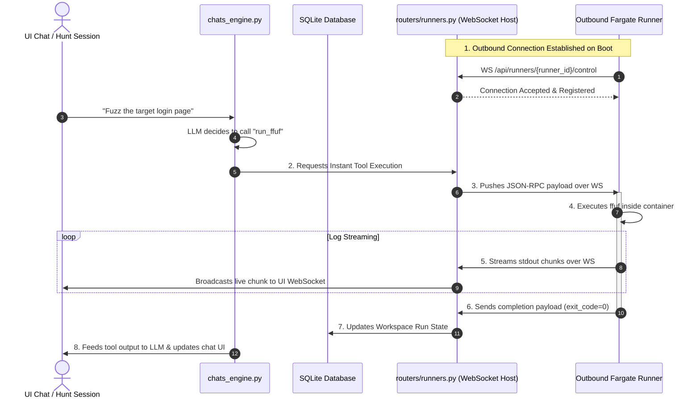

# ADR 0002: Persistent Outbound WebSocket Control Channel for Low-Latency Runner Dispatching

## Status
Proposed

## Context
Ferret utilizes transient outbound runners (running in either local Docker containers or AWS Fargate tasks) to execute security scanning plans. These runners communicate with the central API server over HTTP.

### Problem
The current communication protocol utilizes **HTTP Polling** (the runner requests jobs from `/api/runners/poll` every 3 seconds). While robust for asynchronous background Plan Runs, this polling design introduces two major limitations:

1. **High Interaction Latency:** When an analyst uses the AI Agent Chat or starts an interactive "Hunt," tool-execution calls (like `run_ffuf`, `run_katana`, or `run_nuclei`) suffer from up to a 3-second polling delay before the runner picks up the command. For a live chat session, this latency is highly disruptive.
2. **Split-Brain Execution Paths:** To bypass this latency in local environments, the API container currently uses a direct `DockerSandboxExecutor` to execute commands via a local Docker socket (`docker-shim`). However, when targeting remote AWS Fargate Dens, direct `docker exec` is unavailable, forcing the AI Agent's interactive tools to run on the local API host instead of the designated Fargate scanner. This breaks environment parity and leaks execution environments.

## Decision
We will entirely replace the outbound HTTP polling mechanism with a **persistent, outbound WebSocket control channel** established from each runner to the central API server.



### 1. Outbound WebSocket Control Connection
Each runner, upon startup, will establish a persistent, outbound WebSocket connection to the API server at `WS /api/runners/{runner_id}/control`. 
* This preserves the **outbound-only security boundary**: Fargate tasks still do not require any open inbound ports, public DNS, or security group ingress rules.
* The API server registers active WebSocket connections in an in-memory registry: `_active_runners_ws: Dict[str, WebSocket]`.

### 2. Instant Bidirectional Event Dispatching
* **Commands (API to Runner):** When a Hunt, Chat, or Plan schedules a task, the API instantly serializes and pushes a JSON-RPC command execution event to the target runner's WebSocket, reducing latency from up to 3000ms to **under 10ms**.
* **Logs & Completion (Runner to API):** Subprocess stdout/stderr chunks and exit signals are streamed back instantly over the same WebSocket, simplifying logging and eliminating HTTP post-overhead.

### 3. Decoupling from the Local Docker Socket
By routing all interactive Chat/Hunt tools through outbound runners, the local API container no longer requires bind-mounting `/var/run/docker.sock` or using `docker-shim`. The API becomes completely stateless and decoupled from Docker execution, enabling lightweight deployments anywhere (e.g., Serverless, lightweight Cloud VMs).

---

## Technical Specifications

### A. API Connection Registry & Router (`src/apps/api/routers/runners.py`)
```python
import asyncio
from fastapi import APIRouter, WebSocket, WebSocketDisconnect

router = APIRouter()
_active_runners_ws: Dict[str, WebSocket] = {}

@router.websocket("/api/runners/{runner_id}/control")
async def runner_control_channel(websocket: WebSocket, runner_id: str):
    # 1. Authenticate runner key and accept connection
    await websocket.accept()
    _active_runners_ws[runner_id] = websocket
    _log.info(f"Runner {runner_id} connected via WebSocket control channel.")
    
    try:
        # Keep connection open, handle inbound heartbeats and execution completions
        while True:
            message = await websocket.receive_json()
            if message.get("type") == "heartbeat":
                await websocket.send_json({"type": "heartbeat_ack"})
            elif message.get("type") == "execution_log":
                await session_tunnel.stream_log_chunk(message["run_id"], message["chunk"])
            elif message.get("type") == "execution_complete":
                await session_tunnel.complete_session_run(
                    run_id=message["run_id"],
                    exit_code=message["exit_code"],
                    status=message["status"]
                )
    except WebSocketDisconnect:
        _log.warning(f"Runner {runner_id} disconnected.")
    finally:
        _active_runners_ws.pop(runner_id, None)
```

### B. Outbound Runner Loop (`src/apps/lab/runner.py`)
```python
import asyncio
import websockets
import json

async def start_runner_control_loop():
    uri = f"ws://{API_HOST}/api/runners/{RUNNER_ID}/control"
    headers = {"X-Runner-Key": RUNNER_KEY}
    
    async with websockets.connect(uri, extra_headers=headers) as ws:
        logger.info("Successfully established WebSocket control connection with central API.")
        
        async for message_raw in ws:
            msg = json.loads(message_raw)
            if msg.get("type") == "execute_command":
                # Start non-blocking task to run subprocess and stream logs back
                asyncio.create_task(execute_and_stream(ws, msg))
```

---

## Consequences

### Positive
* **Immediate Responsiveness:** Latency for tool executions inside AI chats and background Hunts drops to near-zero, making the agent feel highly responsive.
* **Simplified Security Posture:** Eliminates the Docker socket bind-mount from the API container, mitigating risk and removing the custom `docker-shim` from the server.
* **Unified Parity:** Interactive tool calls run on the exact same outbound Fargate scan containers as scheduled background tasks, ensuring matching network policies, proxies, and target reachability.
* **Reduced Server Overhead:** Removes hundreds of HTTP polling requests per minute, dramatically reducing database lease transactions and API CPU usage.

### Negative / Risks
* **Connection State Management:** Bidirectional WebSockets require robust reconnection and back-off strategies on the runner to handle network dropouts or container redeploys cleanly.
* **Proxy Timeouts:** Public load balancers or API gateways (e.g., AWS ALBs) often close idle WebSockets after 60 seconds; the runner must send periodic heartbeat/ping packets to keep the control tunnel alive.
