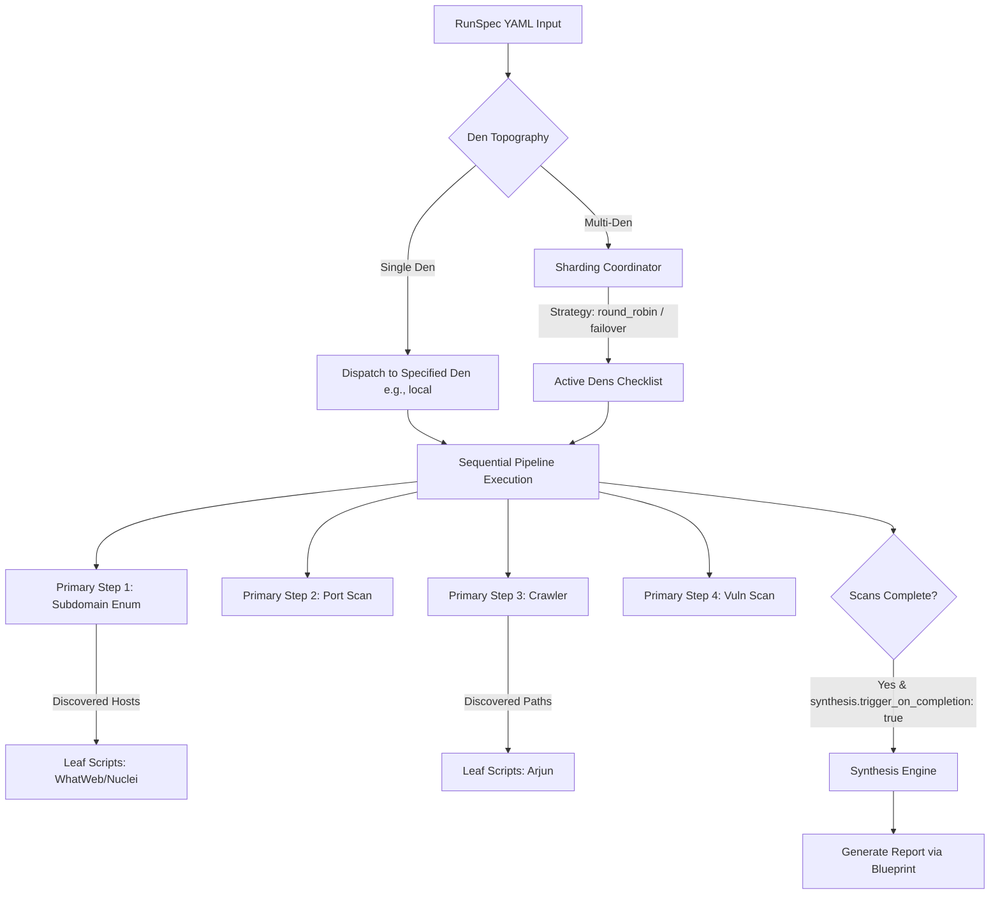

# Declarative RunSpec (`runspec.yaml`) Reference Specification

This document provides a comprehensive reference specification for Ferret’s canonical, declarative pipeline configuration format: **RunSpec (`runspec.yaml`)**. This standard replaces the legacy `workflow.yaml` representation.

---

## 1. Overview & Architecture

The **RunSpec** (`runspec.yaml`) is Ferret’s central declarative configuration format. It defines:
1. **Target Boundary**: The seed entrypoint URL or domain.
2. **Execution Topography**: Whether the run targets a single **Den** or shards work across multiple secure worker clusters (**Dens**).
3. **Pipeline Stages**: A sequential checklist of active tool plans, optionally carrying parameters and conditional nested child actions (**leaf scripts**).
4. **Downstream Synthesis**: Rules to compile raw scan logs and findings into finished reports once pipeline steps conclude.

### Dataflow Diagram



---

## 2. YAML Schema Reference

### Root Fields

| Field Name | Type | Required | Description |
| :--- | :--- | :--- | :--- |
| `target_url` | string | **Yes** | Seed target host or URL (e.g., `https://example.com`). |
| `runner_den` | string | **Yes** | Targeting identifier. Standard values: `local`, specific AWS cluster IDs (`aws-den-us-east-1`, `aws-den-eu-central-1`), or `multi` to engage sharding. |
| `target_sharding` | object | No | **Required only if `runner_den` is set to `multi`**. Defines multi-cluster distribution parameters. |
| `pipeline` | array | **Yes** | Sequential list of orchestration steps. |
| `synthesis` | object | No | Auto-reporting and compilation configurations evaluated upon run completion. |

---

### `target_sharding` Object

| Field Name | Type | Required | Default | Description |
| :--- | :--- | :--- | :--- | :--- |
| `strategy` | string | **Yes** | - | Distribution method: `round_robin` (split targets evenly), `geo_proximity` (route by target DNS/hosting location), or `failover` (use backup dens in strict index sequence). |
| `dens` | list of strings| **Yes** | - | Active Dens allocated to this job. |
| `max_concurrency_per_den` | integer | No | `1` | Max simultaneous tasks executed per cluster. |

---

### `pipeline` Array (Step Object)

| Field Name | Type | Required | Description |
| :--- | :--- | :--- | :--- |
| `step` | string | **Yes** | Semantic pipeline step name (e.g., `subdomain_enumeration`, `port_scanning`, `technology_fingerprint`, `spider_endpoints`, `vulnerability_scan`). |
| `plan` | string | **Yes** | Canonical binary/plan wrapper to invoke (e.g., `builtin:passive_subdomain_enum`, `builtin:nmap`, `builtin:whatweb`, `builtin:katana`, `builtin:nuclei`). |
| `params` | object | No | Key-value settings passed to the wrapper (e.g., `profile: service_intel`). |
| `leaf_scripts` | list of strings| No | Downstream plans to execute instantly against sub-targets (subdomains or directory paths) spawned dynamically during step execution. |

---

### `synthesis` Object

| Field Name | Type | Required | Description |
| :--- | :--- | :--- | :--- |
| `trigger_on_completion` | boolean | **Yes** | Automatically executes reporting once all pipeline steps and leaf tasks exit. |
| `blueprint` | string | **Yes** | Synthesis configuration file name (e.g., `web_pentest_executive_report.yaml`, `pci_dss_compliance.yaml`). |
| `write_directory` | string | **Yes** | Destination folder inside the workspace (e.g., `reports/`). |

---

## 3. Real-World Compilation Examples

### Example A: Single Local Den (Simple Scan)
A lightweight run executed strictly inside the local environment with no downstream reporting:

```yaml
# Declarative Ferret RunSpec Definition
target_url: https://target.local
runner_den: local

pipeline:
  - step: port_scanning
    plan: builtin:nmap
    params:
      profile: fast
  - step: technology_fingerprint
    plan: builtin:whatweb
```

### Example B: Multi-Den Sharding
An enterprise scan targeting multiple geographically distributed regions under a `round_robin` strategy:

```yaml
# Declarative Ferret RunSpec Definition
target_url: https://enterprise-infra.com
runner_den: multi

target_sharding:
  strategy: round_robin
  dens:
    - aws-den-us-east-1
    - aws-den-eu-central-1
  max_concurrency_per_den: 10

pipeline:
  - step: port_scanning
    plan: builtin:nmap
    params:
      profile: service_intel
  - step: technology_fingerprint
    plan: builtin:whatweb
  - step: vulnerability_scan
    plan: builtin:nuclei
```

### Example C: Advanced Recursive Pipeline with Leaf-Triggering & Auto-Synthesis
A complex, vertically-sliced assessment targeting subdomains and directory paths, running specific tests downstream on each discovery, and auto-compiling a PCI compliance document:

```yaml
# Declarative Ferret RunSpec Definition
target_url: https://scope.internal
runner_den: aws-den-us-east-1

pipeline:
  - step: subdomain_enumeration
    plan: builtin:passive_subdomain_enum
    leaf_scripts:
      - builtin:whatweb
      - builtin:nuclei
  - step: port_scanning
    plan: builtin:nmap
    params:
      profile: service_intel
  - step: technology_fingerprint
    plan: builtin:whatweb
  - step: spider_endpoints
    plan: builtin:katana
    leaf_scripts:
      - builtin:arjun
  - step: vulnerability_scan
    plan: builtin:nuclei

# Downstream RunSpec Synthesis upon scan completion
synthesis:
  trigger_on_completion: true
  blueprint: pci_dss_compliance.yaml
  write_directory: reports/
```

---

## 4. Backend Implementation Plan (Python / Pydantic)

To process raw YAML/RunSpec definitions within the FastAPI backend (`src/apps/api/`), the Pydantic schemas in `models.py` must support structural parsing.

### Recommended Pydantic Schema Model (`src/apps/api/models.py`)

```python
from pydantic import BaseModel, Field, HttpUrl
from typing import List, Optional, Dict, Any

class TargetSharding(BaseModel):
    strategy: str = Field(..., description="round_robin | geo_proximity | failover")
    dens: List[str] = Field(..., description="List of targeted Den IDs")
    max_concurrency_per_den: int = Field(default=1, ge=1)

class PipelineStep(BaseModel):
    step: str = Field(..., description="Identifier name of the step")
    plan: str = Field(..., description="Plan wrapper ID (e.g. 'builtin:nmap')")
    params: Optional[Dict[str, Any]] = Field(default=None, description="Optional step execution overrides")
    leaf_scripts: Optional[List[str]] = Field(default_factory=list, description="Downstream plans run against items found")

class SynthesisBlock(BaseModel):
    trigger_on_completion: bool = Field(default=True)
    blueprint: str = Field(..., description="Reporting YAML blueprint file")
    write_directory: str = Field(default="reports/")

class RunSpecSchema(BaseModel):
    """Canonical declarative RunSpec schema representing a parsed runspec.yaml"""
    target_url: str = Field(..., description="Target boundary seed")
    runner_den: str = Field(default="local", description="Den host target ('local', 'multi', or specific ID)")
    target_sharding: Optional[TargetSharding] = None
    pipeline: List[PipelineStep] = Field(default_factory=list)
    synthesis: Optional[SynthesisBlock] = None
```

### YAML-Parsing Endpoint (`src/apps/api/routers/runs.py`)

```python
import yaml
from fastapi import APIRouter, HTTPException, Request
from models import RunSpecSchema

# Within router:
@router.post("/api/runs/yaml", status_code=201)
async def create_run_from_yaml(request: Request):
    """Parse incoming raw RunSpec YAML and register dynamic runs sequential flow."""
    body_bytes = await request.body()
    raw_yaml = body_bytes.decode("utf-8")
    
    try:
        parsed_dict = yaml.safe_load(raw_yaml)
        # Validate against the Pydantic schema
        runspec = RunSpecSchema(**parsed_dict)
    except yaml.YAMLError as ye:
        raise HTTPException(status_code=400, detail=f"Invalid YAML Syntax: {str(ye)}")
    except Exception as ve:
        raise HTTPException(status_code=422, detail=f"Validation failed: {str(ve)}")
        
    # Process sequential run creation and pass to ScriptExecutionEngine...
    return {"message": "RunSpec pipeline successfully initialized", "targets": runspec.target_url}
```

---

## 5. UI Checklist Compilation Logic

The frontend dynamic compiler converts state variables (such as checkboxes) into syntax-highlighted YAML previews in real-time.

```javascript
// Rule 1: Den Count Check
let selectedDens = [];
if (shardDenLocal.checked) selectedDens.push("local");
if (shardDenUsEast.checked) selectedDens.push("aws-den-us-east-1");
if (shardDenEuCentral.checked) selectedDens.push("aws-den-eu-central-1");

// If selectedDens.length === 1 -> runner_den: <selectedDens[0]>
// If selectedDens.length > 1 -> runner_den: multi (Expand target_sharding panel)
// If selectedDens.length === 0 -> runner_den: local

// Rule 2: Subdomain Enumeration step compilation
if (checkSubdomain.checked) {
  // If runOnHosts.checked is true:
  // Gather children: hostLeafWhatWeb.checked -> "builtin:whatweb", hostLeafNuclei.checked -> "builtin:nuclei"
  // If children > 0 -> Add leaf_scripts node
}

// Rule 3: Katana Crawler step compilation
if (checkKatana.checked) {
  // If runOnPaths.checked is true and pathLeafArjun.checked is true -> Add leaf_scripts: ["builtin:arjun"]
}
```
